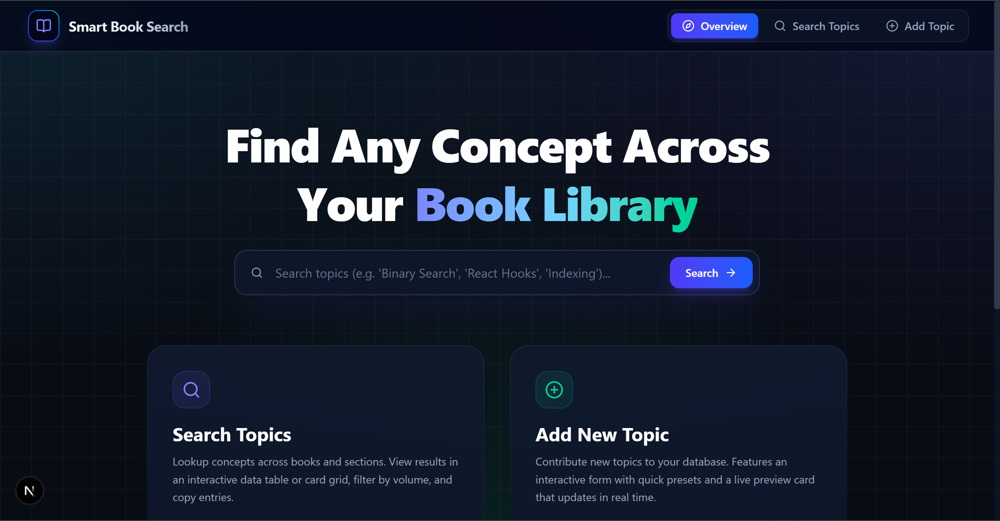
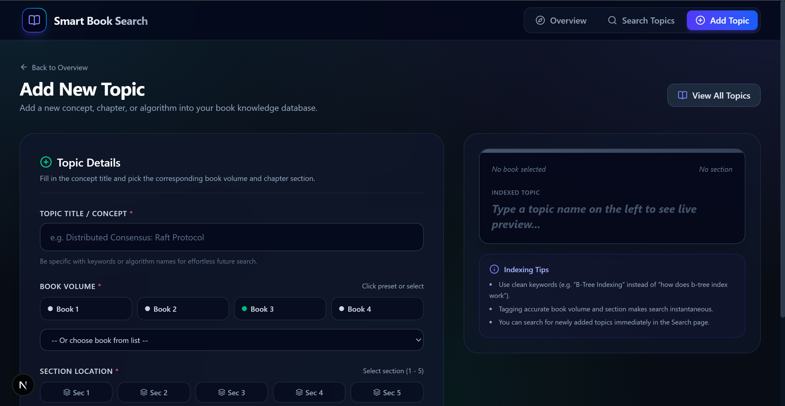
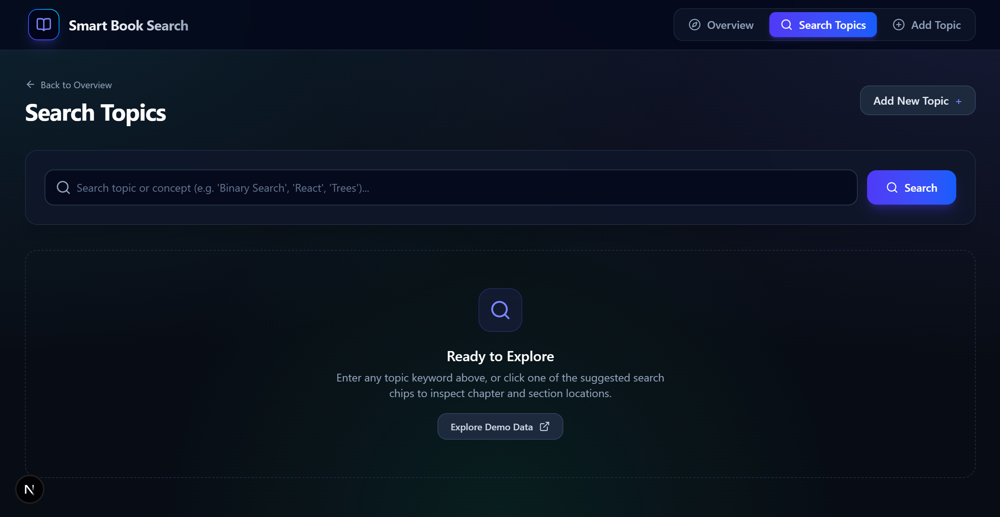
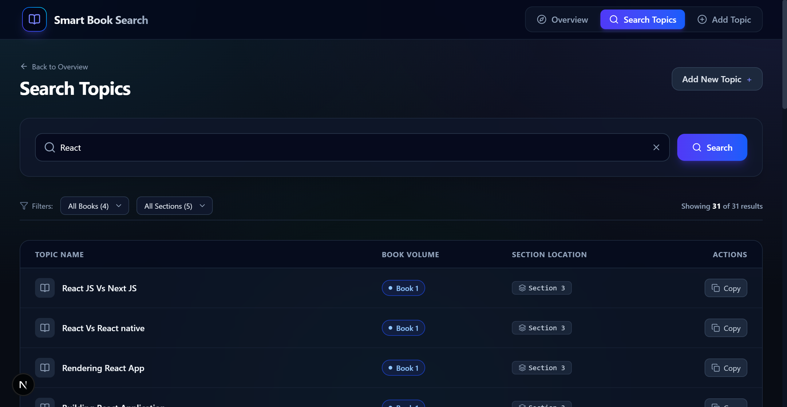

# Smart Book Search

A simple web application to index and find topics across your books.

## What Problem Does This Solve?
The idea for this project came while I had multiple books to read from and was constantly getting confused about which topic was covered in which book.

This application provides a quick reference index so you can search any topic and instantly know which book and section it belongs to.

## Features

### 1. Search Topics
- **Search by Topic**: Type any keyword or concept to find matching entries.
- **Filter by Book & Section**: Narrow down search results by selecting a specific book or section.
- **Quick Results**: View the topic name, book, and section clearly in card format.

### 2. Add New Topic
- Add new concepts to the catalog with a simple form.
- Assign the topic to its respective book and section.

## How to Start the Application

1. **Install dependencies:**
   ```bash
   npm install
   ```

2. **Run the development server:**
   ```bash
   npm run dev
   ```

3. **Access the app:**
   Open [http://localhost:3002](http://localhost:3002) in your browser.

> **Note:** Make sure the backend service (`book-search-backend`) is running on `http://localhost:8000` so the app can fetch and save topics.

## Implementation Details
- **Frontend**: Next.js (App Router), React, TypeScript, Tailwind CSS, Material-UI, and Axios.
- **Backend**: Node.js, Express.js, and MongoDB (via Mongoose).
- **Communication**: Frontend sends REST API requests (`/get-topics` and `/add-topic`) to the backend.

## Screenshots

### 1. Home Page


### 2. Add Topic Page


### 3. Search Page


### 4. Search Page with Results

